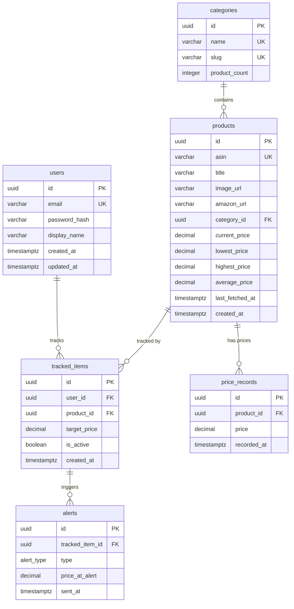

# Database Detailed Design

## 1. ER Diagram



## 2. Table Definitions

### E-01: Users (`users`)

| Column | Type | Constraints | Description |
|--------|------|-------------|-------------|
| id | uuid | PK, DEFAULT gen_random_uuid() | Unique identifier |
| email | varchar(255) | UNIQUE, NOT NULL | Login email |
| password_hash | varchar(255) | NOT NULL | bcrypt hash |
| display_name | varchar(100) | NULL | Display name |
| reset_token | varchar(255) | NULL | Password reset token |
| reset_token_expires | timestamptz | NULL | Reset token expiry |
| created_at | timestamptz | NOT NULL, DEFAULT now() | Registration date |
| updated_at | timestamptz | NOT NULL, DEFAULT now() | Last update |

**Indexes:**
- `idx_users_email` UNIQUE on `email`

---

### E-02: Products (`products`)

| Column | Type | Constraints | Description |
|--------|------|-------------|-------------|
| id | uuid | PK, DEFAULT gen_random_uuid() | Unique identifier |
| asin | varchar(20) | UNIQUE, NOT NULL | Amazon Standard ID |
| title | varchar(500) | NOT NULL | Product title |
| image_url | varchar(1000) | NULL | Product image URL |
| amazon_url | varchar(1000) | NOT NULL | Full Amazon AU link |
| category_id | uuid | FK → categories.id, NULL | Category reference |
| current_price | decimal(10,2) | NULL | Latest fetched price (AUD) |
| lowest_price | decimal(10,2) | NULL | All-time lowest |
| highest_price | decimal(10,2) | NULL | All-time highest |
| average_price | decimal(10,2) | NULL | Computed average |
| last_fetched_at | timestamptz | NULL | Last PA API fetch |
| created_at | timestamptz | NOT NULL, DEFAULT now() | First tracked date |

**Indexes:**
- `idx_products_asin` UNIQUE on `asin`
- `idx_products_category_id` on `category_id`
- `idx_products_last_fetched` on `last_fetched_at` (for scheduler priority)

---

### E-03: Price Records (`price_records`)

| Column | Type | Constraints | Description |
|--------|------|-------------|-------------|
| id | uuid | PK, DEFAULT gen_random_uuid() | Unique identifier |
| product_id | uuid | FK → products.id, NOT NULL, ON DELETE CASCADE | Product reference |
| price | decimal(10,2) | NOT NULL | Price in AUD |
| recorded_at | timestamptz | NOT NULL, DEFAULT now() | Snapshot timestamp |

**Indexes:**
- `idx_price_records_product_recorded` on `(product_id, recorded_at DESC)` — primary query pattern
- `idx_price_records_recorded_at` on `recorded_at` — for cleanup/retention

**Partitioning:** Consider range-partitioning by `recorded_at` (monthly) if table exceeds 10M rows.

---

### E-04: Tracked Items (`tracked_items`)

| Column | Type | Constraints | Description |
|--------|------|-------------|-------------|
| id | uuid | PK, DEFAULT gen_random_uuid() | Unique identifier |
| user_id | uuid | FK → users.id, NOT NULL, ON DELETE CASCADE | User reference |
| product_id | uuid | FK → products.id, NOT NULL, ON DELETE CASCADE | Product reference |
| target_price | decimal(10,2) | NULL | Alert threshold (AUD) |
| is_active | boolean | NOT NULL, DEFAULT true | Tracking active flag |
| created_at | timestamptz | NOT NULL, DEFAULT now() | When tracking started |

**Indexes:**
- `idx_tracked_items_user_id` on `user_id`
- `idx_tracked_items_user_product` UNIQUE on `(user_id, product_id)` — prevent duplicates
- `idx_tracked_items_active_alerts` on `(is_active, target_price)` WHERE `is_active = true AND target_price IS NOT NULL` — for alert checker

---

### E-05: Alerts (`alerts`)

| Column | Type | Constraints | Description |
|--------|------|-------------|-------------|
| id | uuid | PK, DEFAULT gen_random_uuid() | Unique identifier |
| tracked_item_id | uuid | FK → tracked_items.id, NOT NULL, ON DELETE CASCADE | Tracked item ref |
| type | varchar(20) | NOT NULL, DEFAULT 'price_drop' | Alert type enum |
| price_at_alert | decimal(10,2) | NOT NULL | Price when alert fired |
| sent_at | timestamptz | NOT NULL, DEFAULT now() | When email was sent |

**Alert types:** `price_drop`, `back_in_stock`, `deal_score_change`

**Indexes:**
- `idx_alerts_tracked_item_id` on `tracked_item_id`
- `idx_alerts_sent_at` on `sent_at DESC`

---

### E-06: Categories (`categories`)

| Column | Type | Constraints | Description |
|--------|------|-------------|-------------|
| id | uuid | PK, DEFAULT gen_random_uuid() | Unique identifier |
| name | varchar(200) | UNIQUE, NOT NULL | Category name |
| slug | varchar(200) | UNIQUE, NOT NULL | URL-safe slug |
| product_count | integer | NOT NULL, DEFAULT 0 | Cached count of tracked products |

**Indexes:**
- `idx_categories_slug` UNIQUE on `slug`

---

## 3. Refresh Token Table (for JWT refresh)

### `refresh_tokens`

| Column | Type | Constraints | Description |
|--------|------|-------------|-------------|
| id | uuid | PK, DEFAULT gen_random_uuid() | Unique identifier |
| user_id | uuid | FK → users.id, NOT NULL, ON DELETE CASCADE | User reference |
| token | varchar(255) | UNIQUE, NOT NULL | Refresh token value |
| expires_at | timestamptz | NOT NULL | Token expiry |
| created_at | timestamptz | NOT NULL, DEFAULT now() | When issued |

**Indexes:**
- `idx_refresh_tokens_token` UNIQUE on `token`
- `idx_refresh_tokens_user_id` on `user_id`

---

## 4. Cursor Pagination Strategy

All list endpoints use cursor-based pagination for infinite scroll:

```
GET /api/products?cursor={last_id}&limit=20&sort=price_drop
```

- **Cursor:** UUID of last item in previous page
- **Limit:** Default 20, max 50
- **Response includes:** `next_cursor` (null if last page)

---

## 5. Data Retention

| Table | Retention | Strategy |
|-------|-----------|----------|
| price_records | 2 years | Archive older records to cold storage |
| alerts | 1 year | Soft delete after 1 year |
| refresh_tokens | Auto-expire | Cron job cleans expired tokens daily |
